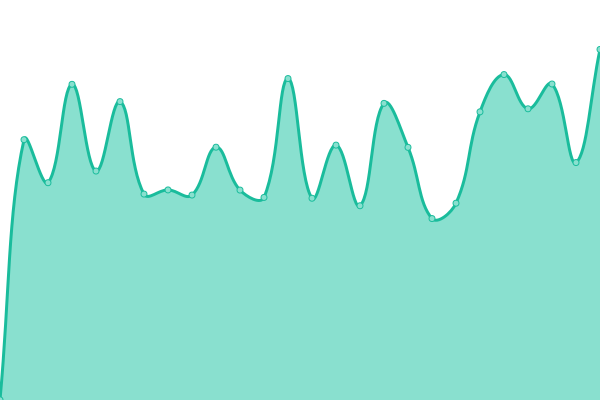

# [📈 Live Status](https://Linisdjxm.github.io/uptest): <!--live status--> **🟧 Partial outage**

This repository contains the open-source uptime monitor and status page for [Linisdjxm](https://Linisdjxm.github.io/uptest), powered by [Upptime](https://github.com/upptime/upptime).

With [Upptime](https://upptime.js.org), you can get your own unlimited and free uptime monitor and status page, powered entirely by a GitHub repository. We use [Issues](https://github.com/Linisdjxm/uptest/issues) as incident reports, [Actions](https://github.com/Linisdjxm/uptest/actions) as uptime monitors, and [Pages](https://Linisdjxm.github.io/uptest) for the status page.

<!--start: status pages-->
<!-- This summary is generated by Upptime (https://github.com/upptime/upptime) -->
<!-- Do not edit this manually, your changes will be overwritten -->
<!-- prettier-ignore -->
| URL | Status | History | Response Time | Uptime |
| --- | ------ | ------- | ------------- | ------ |
|  [GW](https://www.gfwiki.org) | 🟩 Up | [gw.yml](https://github.com/Linisdjxm/uptest/commits/HEAD/history/gw.yml) | 

 2134ms
     
 | 

<a href="https://Linisdjxm.github.io/uptest/history/gw">100.00%</a>
    

|  [MW](https://zh.moegirl.org.cn) | 🟥 Down | [mw.yml](https://github.com/Linisdjxm/uptest/commits/HEAD/history/mw.yml) | 

 2994ms
     
 | 

<a href="https://Linisdjxm.github.io/uptest/history/mw">99.48%</a>
    

|  [IMWB](https://www.ismoegirl.online) | 🟥 Down | [imwb.yml](https://github.com/Linisdjxm/uptest/commits/HEAD/history/imwb.yml) | 

 85ms
     
 | 

<a href="https://Linisdjxm.github.io/uptest/history/imwb">0.00%</a>
    

<!--end: status pages-->

[**Visit our status website →**](https://Linisdjxm.github.io/uptest)

## 📄 License

- Powered by: [Upptime](https://github.com/upptime/upptime)
- Code: [MIT](./LICENSE) © [Linisdjxm](https://Linisdjxm.github.io/uptest)
- Data in the `./history` directory: [Open Database License](https://opendatacommons.org/licenses/odbl/1-0/)
